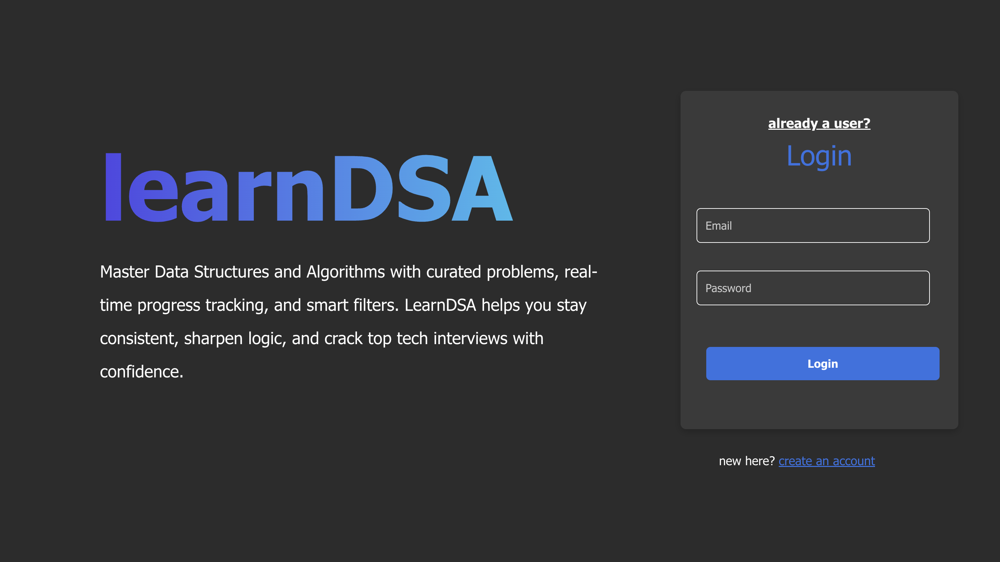
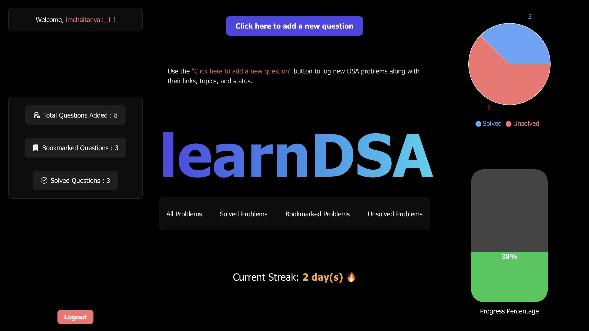
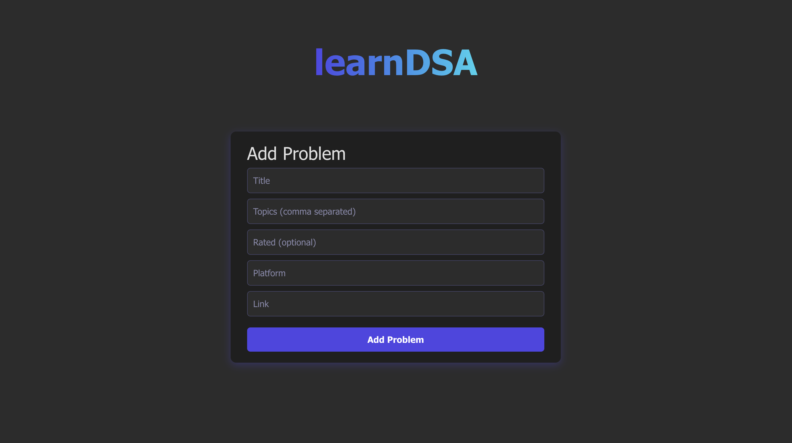
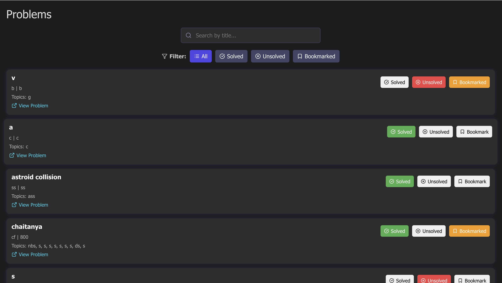

# learnDSA

An interactive web platform to help students practice and organize Data Structures and Algorithms problems effectively. Built using the **MERN stack**, it features user authentication, problem management, status tracking (solved/unsolved/bookmark), and insightful visualizations.

[🚀 Live Demo](https://learn-dsa-six.vercel.app)

---

## 🛠️ Tech Stack

- **Frontend:** React, HTML, CSS, Chart.js / D3.js
- **Backend:** Node.js, Express.js
- **Database:** MongoDB (Mongoose)
- **Authentication:** JWT (JSON Web Tokens)
- **Deployment:** Vercel (Frontend) & Render (Backend)

---

## 🔑 Features

- 👤 JWT-based User Authentication  
- 📌 Add, edit, and delete DSA problems  
- 🧠 Tag problems as Solved / Unsolved / Important / Bookmarked  
- 🔍 Smart filtering and sorting  
- 📊 Visual progress charts  
- 🧱 Modular, scalable codebase  

---

## 📸 Screenshots

| Login Page | Dashboard | Add Questions | All Questions |
|------------|-----------|----------------|----------------|
|  |  |  |  |

---

## 🚀 Getting Started Locally

Follow these steps to run the project on your local machine:

---

### 1️⃣ Clone the Repository

```bash
git clone https://github.com/chaitanya1-stack/learnDSA.git
cd learn-dsa
```

---

### 2️⃣ Setup Backend (Node.js + Express)

cd backend
npm install


Create a .env file in the backend/ directory with the following content:
```PORT=5050
MONGO_URI=your_mongodb_connection_string
JWT_SECRET=your_jwt_secret_key ```

Start the backend server:
npm run dev
Server will run at: http://localhost:5050

---

### 3️⃣ Setup Frontend (React)

In a new terminal tab, run:
cd frontend
npm install
npm start

Ensure the API URL is correctly set in frontend/src/api.js:
const API_URL = 'http://localhost:5050/api';

---

## 🌐 Deployment

- **Frontend:** Deployed on [Vercel](https://learn-dsa-six.vercel.app)
- **Backend API :** Hosted on Render (private)

---

## 🤝 Contributing

Pull requests are welcome! If you have suggestions or improvements, feel free to fork the repo and open a PR. For major changes, please open an issue first to discuss what you’d like to change.

---

## 📄 License

This project is licensed under the [MIT License](LICENSE).

---

> 💻 Built with love by [Chaitanya](https://github.com/chaitanya1-stack)


